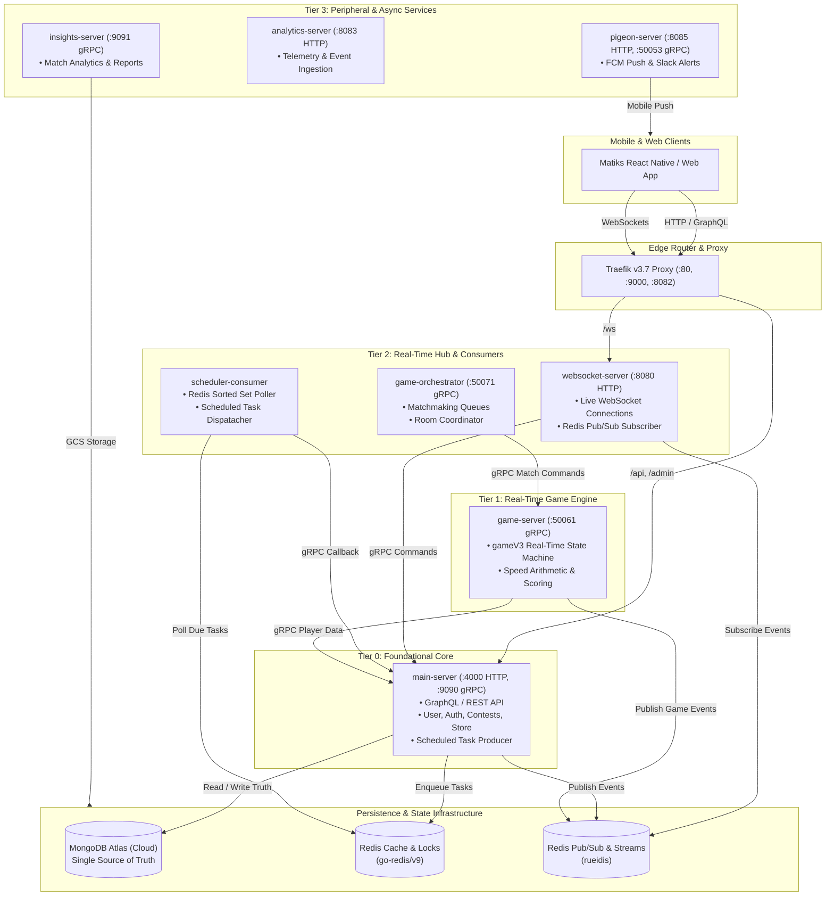

# Comprehensive Technical Deep-Dive Report: Matiks Backend Monorepo (`matiks-monorepo`)

---

## 1. Executive Summary: What is the Matiks Backend?

If the **Matiks Client** (the mobile and web app) is the *face, steering wheel, and dashboard* that players touch and see, the **Matiks Backend Monorepo** (`matiks-monorepo`) is the *engine, transmission, electrical grid, and air traffic control tower* powering everything behind the scenes.

Matiks is a high-speed competitive mathematics and logic puzzle esports platform. In a game where players solve arithmetic problems in milliseconds and compete for global ranking, the backend must process actions instantly, prevent cheating, match players by skill, update leaderboards, track virtual coins, and handle thousands of simultaneous live matches without dropping a single packet.

```
┌──────────────────────────────────────────────────────────────────────────────────────────────────┐
│                                       MATIKS MOBILE & WEB APPS                                   │
│                        (React Native, Expo, WebSockets, GraphQL, C++/Rust)                       │
└─────────────────────────────────────────┬────────────────────────────────────────────────────────┘
                                          │
                  ┌───────────────────────┴───────────────────────┐
                  │ 1. GraphQL / REST Queries                     │ 2. Real-Time WebSocket duplex
                  │    (Auth, Profile, Shop, Quests)              │    (Live Duels, Chat, Presence)
                  ▼                                               ▼
┌──────────────────────────────────────────────────────────────────────────────────────────────────┐
│                                    TRAEFIK REVERSE PROXY (:80)                                   │
│                           (Traffic Cop & Front Gate in Docker Compose)                           │
└──────────────────┬──────────────────────────────────────────────┬────────────────────────────────┘
                   │ /api, /admin                                 │ /ws
                   ▼                                              ▼
┌───────────────────────────────────────┐      ┌───────────────────────────────────────────────────┐
│        MAIN-SERVER (Port 4000)        │      │          WEBSOCKET-SERVER (Port 8080)             │
│  • User accounts, Auth, Profiles      │      │  • Holds 10,000+ live player connections          │
│  • Store, Pi-Coins, XP Boosters       │      │  • Listens to Redis channels and pushes to phones │
│  • Leagues, Contests, Brumble Cup     │      │  • Sends player moves to backend via gRPC         │
│  • Writes truth to MongoDB Atlas      │      └─────────────────────────┬─────────────────────────┘
└──────────────────┬────────────────────┘                                │
                   │                                                     │
                   ├──────────────────┬──────────────────────────────────┤
                   ▼                  ▼                                  ▼
┌──────────────────────────┐ ┌──────────────────────────┐ ┌────────────────────────────────────────┐
│     REDIS (Port 6379)    │ │   MONGODB ATLAS (Cloud)  │ │      GAME-SERVER & ORCHESTRATOR        │
│ • Lightning-fast Cache   │ │ • Permanent Database     │ │      (Ports 50061 & 50071 gRPC)        │
│ • Pub/Sub Event Broadcast│ │ • Single Source of Truth │ │ • Real-time game logic & duel engine   │
│ • Scheduled Task Queue   │ │ • Users, Matches, Scores │ │ • Matchmaking queue & room allocation  │
└──────────────────────────┘ └──────────────────────────┘ └────────────────────────────────────────┘
```

### 1.1. Core Responsibilities of the Backend
1. **Real-Time Multiplayer Duels**: Matching players across the globe and running high-frequency arithmetic games with millisecond precision.
2. **State & Account Management**: Safely recording user profiles, progression, tournament brackets, Elo ratings, and virtual currencies.
3. **Scheduled Events & Automation**: Automatically advancing tournament rounds, resetting daily streaks at midnight, and calculating weekly league promotions.
4. **Push Notifications & Communication**: Sending instant push notifications to mobile devices when friends challenge each other or tournaments begin.
5. **Anti-Cheat & Question Security**: Encrypting math questions and validating answers on the server so malicious users cannot peek at answers in their phone's memory.

---

## 2. Monorepo & Backend Fundamentals: Explained for Beginners

Before diving into the code, let's understand the basic tools and terms used in this project.

### 2.1. What is a "Monorepo"?
* **Everyday Analogy**: Imagine running a car company. You could build the engine, tires, and audio system in three separate factories across town (a *multi-repo* setup). Every time the engine changes a bolt size, the tire factory might not know and things break. Instead, a **monorepo** ("monolithic repository") puts all the blueprints, tools, and parts in **one single building**.
* **In Matiks**: All 9 backend services and all 16 shared code libraries live inside one Git repository (`matiks-monorepo`). When a developer updates a shared package (e.g. how questions are encrypted), they can update the server and test everything in a single Git commit without coordinating across multiple repositories.

### 2.2. What is Go (Golang)?
* **Why Go?**: Go is a modern programming language created at Google. It is compiled directly into machine code (meaning it runs at near C++ speeds), has a tiny memory footprint, starts up in milliseconds, and has built-in support for running millions of lightweight background tasks simultaneously (**Goroutines**).
* **Toolchain Version**: Matiks runs on **Go 1.26.5**.

### 2.3. How Go Modules Work in this Monorepo (`go.work`)
* **The Problem**: In standard Go, each folder with a `go.mod` file is treated as a separate package downloaded from the internet (e.g., `github.com/matiks-com/logger`). If you edit `packages/logger`, your service wouldn't see the edit until you pushed it to GitHub.
* **The Solution (`go.work`)**: Go Workspaces allow all 20+ `go.mod` modules to link together locally on your laptop. When `main-server` imports `packages/logger`, Go immediately uses the local files on your hard drive.

### 2.4. What is Bazel & Gazelle?
* **Bazel**: A hyper-fast, reproducible build tool developed by Google. When you build large projects with standard tools, modifying one small file often causes the compiler to rebuild everything from scratch. Bazel caches every intermediate step. If you only change one function in `main-server`, Bazel rebuilds *only* that file in less than 1 second.
* **Gazelle**: Writing Bazel configuration files (`BUILD.bazel`) by hand can be tedious. Gazelle is an automated robot that scans Go code, sees what packages you imported, and automatically writes the `BUILD.bazel` files for you (`task bazel:gazelle`).

### 2.5. What is Taskfile (`Taskfile.yml`)?
* **Why Taskfile?**: Instead of memorizing 50 long shell commands like `bazel build //...` or `docker compose -f ... up`, Taskfile provides clean, short shortcuts called "tasks" (e.g., `task dev:up`, `task sync`, `task check`). It replaces older Unix `Makefiles`.

---

## 3. High-Level Architecture & Tech Stack

The Matiks backend is built around a **microservice architecture** connected by three primary communication channels: **GraphQL/REST** (external web/mobile queries), **WebSockets** (real-time duplex streaming), and **gRPC** (lightning-fast internal binary communication between servers).



### 3.1. Technology Specification Matrix

| Component / Layer | Technology | Version | Purpose & Rationale |
| :--- | :--- | :--- | :--- |
| **Language & Runtime** | Go (Golang) | 1.26.5 | Ultra-fast execution, low memory overhead, and native concurrency (goroutines). |
| **Build & Workspace** | Bazel + Gazelle | Bazel 8.x / rules_go | Hermetic, reproducible compilation with sub-second incremental builds. |
| **Edge Router** | Traefik | v3.7.10 | Docker-based reverse proxy routing traffic to appropriate backend ports. |
| **Primary Database** | MongoDB Atlas | Cloud Cluster | Document database acting as the single source of truth for users, games, and history. |
| **In-Memory Cache & Locks** | Redis (`go-redis/v9`) | 8.2.2-alpine | Sub-millisecond key-value caching, distributed mutexes, and sorted task queues. |
| **High-Throughput Pub/Sub** | Redis (`rueidis`) | Auto-pipelined | High-throughput client dedicated strictly to real-time pub/sub event broadcasting. |
| **Internal RPC Transport** | gRPC / Protocol Buffers | proto3 / buf | Strongly-typed, binary protocol for microsecond inter-service communication. |
| **External API Surface** | GraphQL (`gqlgen`) & REST (`chi`) | v0.17+ / v5 | Schema-first API allowing mobile clients to request exactly the fields they need. |
| **Dependency Injection** | Uber Fx | v1.23+ | Clean application lifecycle management (`OnStart`/`OnStop`) without global variables. |
| **Structured Logging** | `zlog` (Uber Zap wrapper) | Custom | High-speed JSON logging with correlated OpenTelemetry trace and span IDs. |
| **Observability & Tracing** | OpenTelemetry (OTEL) | SDK v1.34+ | End-to-end distributed tracing sent to Google Cloud Trace and metrics to Prometheus. |
| **Task Runner** | Taskfile (`task`) | v3.41+ | Unified CLI commands for local development, linting, code generation, and CI checks. |

---

## 4. Architectural Patterns: How Code is Structured Inside Services

Every service in the monorepo adheres to strict software design patterns to ensure clean, maintainable, and testable code.

### 4.1. The 3-Layer Architecture (`Transport -> Domain -> Infrastructure`)

Inside every service (most notably [`services/main-server`](file:///Users/pramiths/Documents/Matiks/matiks-monorepo/services/main-server)), code is organized into 3 distinct layers with a one-way dependency rule:

```
┌─────────────────────────────────────────────────────────────────────────────┐
│ 1. TRANSPORT LAYER (internal/api/, internal/graph/, internal/grpc/)         │
│    • Receives raw requests from the outside world (HTTP, GraphQL, gRPC).    │
│    • Validates input format, checks auth tokens, and unpacks headers.       │
│    • Calls the Domain layer.                                                │
└──────────────────────────────────────┬──────────────────────────────────────┘
                                       │ calls
                                       ▼
┌─────────────────────────────────────────────────────────────────────────────┐
│ 2. DOMAIN LAYER (internal/domain/<feature>/)                                │
│    • The pure brain / business logic (e.g. "Calculate XP", "Rank League").  │
│    • Has ZERO knowledge of HTTP, GraphQL, MongoDB, or Redis.                │
│    • Defines "Interfaces" (contracts) for saving data, without knowing how. │
└──────────────────────────────────────┬──────────────────────────────────────┘
                                       │ calls via interfaces
                                       ▼
┌─────────────────────────────────────────────────────────────────────────────┐
│ 3. INFRASTRUCTURE LAYER (internal/infrastructure/repository/, cache/)       │
│    • The physical connections to outside systems (MongoDB queries, Redis).  │
│    • Implements the interfaces defined by the Domain layer.                 │
└─────────────────────────────────────────────────────────────────────────────┘
```

* **The Golden Rule**: The **Domain layer never imports the Transport or Infrastructure layers**. This means you can swap MongoDB for PostgreSQL, or swap GraphQL for gRPC, without touching a single line of business logic!

### 4.2. Dependency Injection with Uber Fx

* **What is Dependency Injection?**: Imagine assembling a toy robot. Instead of the robot's arm building its own battery, you hand the battery to the arm when assembling the robot.
* **How Uber Fx Works**: When a service starts up in `cmd/server/main.go`, Uber Fx looks at all constructors (`NewMongoDBRepository`, `NewUserService`, `NewGraphQLResolver`) and automatically connects them together in the right order. It also provides clean `OnStart` (connect to DB) and `OnStop` (flush logs, close connections) lifecycle hooks.

### 4.3. Hexagonal Architecture (Used in `game-server` and `dailyChallengeV2`)

In the next-generation game engine (`game-server`), the architecture is **Hexagonal (Ports & Adapters)**:
* **Core (Domain & Use Cases)**: Pure game rules (state machines, timers, arithmetic verification).
* **Ports**: Go interfaces declaring what the core needs (e.g., `GameRepoPort`, `EventPublisherPort`).
* **Adapters**:
  * **Driving Adapters**: How the outside world talks *into* the core (e.g. gRPC handlers).
  * **Driven Adapters**: How the core talks *out* to databases or Redis (e.g. Mongo driver, Redis stream publisher).

---

## 5. Deep-Dive: The 9 Backend Services

Let's explore each of the 9 services inside [`services/`](file:///Users/pramiths/Documents/Matiks/matiks-monorepo/services).

```
services/
├── main-server/           # 1. Primary HTTP, GraphQL, Admin & Business Logic Server
├── websocket-server/      # 2. Real-Time WebSocket Hub (Fan-out to Mobile Clients)
├── scheduler-consumer/    # 3. Background Cron & Delayed Task Dispatcher
├── game-server/           # 4. gameV3 Real-Time Game Engine (Hexagonal Architecture)
├── game-orchestrator/     # 5. Matchmaking Queue & Game Room Allocation
├── insights-server/       # 6. Post-Match Performance Insights & Analytics Reports
├── analytics-server/      # 7. High-Volume Telemetry & Event Ingest Pipeline
├── auth-server/           # 8. Authentication & JWT Domain Logic (Embedded Module)
└── pigeon-server/         # 9. Multi-Channel Notification Engine (FCM Push & Slack)
```

---

### 5.1. `main-server` — The Central Command Center
* **Path**: [`services/main-server/`](file:///Users/pramiths/Documents/Matiks/matiks-monorepo/services/main-server)
* **Module**: `github.com/matiks-com/matiks-server-go`
* **Ports**: `4000` (HTTP / GraphQL / REST), `9090` (gRPC Server)
* **Role**: The heart of the platform. Handles user authentication, profile customization, store transactions (Pi-Coins, Statik Coins), avatar unlocks, buddy streaks, leagues, showdown tournaments, and admin dashboards.
* **Key Components**:
  * `internal/graph/`: GraphQL server powered by `gqlgen`. Schema defined in `.graphqls` files.
  * `internal/api/`: Chi HTTP router handling REST endpoints, webhooks, and health checks (`/health`).
  * `internal/domain/`: 30+ domain packages (`user`, `league`, `contest`, `showdown`, `store`, `buddy`, `dailyChallengeV2`).
  * `internal/grpc/server/`: Receives internal gRPC callbacks from `websocket-server` and `scheduler-consumer`.
  * `internal/infrastructure/`: Repositories executing queries against MongoDB Atlas and Redis.

---

### 5.2. `websocket-server` — The Live Real-Time Switchboard
* **Path**: [`services/websocket-server/`](file:///Users/pramiths/Documents/Matiks/matiks-monorepo/services/websocket-server)
* **Module**: `github.com/matiks-com/websocket-package`
* **Port**: `8080` (HTTP Upgrade to WebSocket at `/ws`)
* **Role**: Maintains thousands of simultaneous open TCP/WebSocket connections with active mobile and web players.
* **How It Works**:
  1. When a player opens the app, the client connects to `ws://localhost/ws`.
  2. The server authenticates the player's JWT token and registers the connection in a sharded in-memory **Hub** (`websocket/hub/`).
  3. The server subscribes to Redis pub/sub channels (`packages/infra/pubsub`). When `main-server` or `game-server` publishes an event (e.g. "Opponent scored +10 points"), the WebSocket server instantly pushes that message down to the player's device.
  4. If the player sends a move over the socket, the server forwards the command to `main-server` via gRPC.

---

### 5.3. `scheduler-consumer` — The Automated Alarm Clock & Job Runner
* **Path**: [`services/scheduler-consumer/`](file:///Users/pramiths/Documents/Matiks/matiks-monorepo/services/scheduler-consumer)
* **Module**: `github.com/matiks-com/scheduler-consumer`
* **Port**: Process-only worker (No listening HTTP/gRPC ports)
* **Role**: Executes timed background jobs (e.g., "End tournament round in 5 minutes", "Reset daily streaks at midnight UTC", "Expire unopened challenge after 24 hours").
* **How It Works**:
  1. `main-server` enqueues a future job into a **Redis Sorted Set** (`packages/infra/sortedset`), where the "score" is the exact Unix timestamp when the job should run.
  2. `scheduler-consumer` continuously polls Redis for items whose timestamp has passed.
  3. When a task is due, it calls back into `main-server`'s `SchedulerService` over gRPC (`:9090`) with the task ID.
  4. `main-server` loads the fresh data from MongoDB and executes the business logic.

---

### 5.4. `game-server` — The `gameV3` Real-Time Match Engine
* **Path**: [`services/game-server/`](file:///Users/pramiths/Documents/Matiks/matiks-monorepo/services/game-server)
* **Module**: `github.com/matiks-com/game-server`
* **Port**: `50061` (gRPC Server)
* **Role**: The dedicated, high-performance simulation engine for live multiplayer math duels.
* **Key Architecture**:
  * **Pure State Machine** (`internal/engine/statemachine`): Evaluates game transitions (e.g., `StartGame`, `SubmitAnswer`, `Timeout`, `Resign`) deterministically.
  * **Hexagonal Ports & Adapters**: Keeps game logic 100% decoupled from databases or network transports.
  * **Anti-Cheat Validation**: Validates answer correctness, reaction timestamps, and calculates Elo/Glicko rating adjustments.

---

### 5.5. `game-orchestrator` — The Matchmaker & Room Allocator
* **Path**: [`services/game-orchestrator/`](file:///Users/pramiths/Documents/Matiks/matiks-monorepo/services/game-orchestrator)
* **Module**: `github.com/matiks-com/game-orchestrator`
* **Port**: `50071` (gRPC Server)
* **Role**: Manages the multiplayer matchmaking lobby.
* **How It Works**:
  * Pools waiting players into matchmaking queues based on rating, game mode, and latency/region.
  * Pairs compatible opponents (or match against AI bots if queue time exceeds thresholds).
  * Coordinates with `game-server` to allocate a new game session and notifies the players via Redis pub/sub.

---

### 5.6. `insights-server` — The Post-Match Performance Analyst
* **Path**: [`services/insights-server/`](file:///Users/pramiths/Documents/Matiks/matiks-monorepo/services/insights-server)
* **Module**: `github.com/matiks-com/insights-server`
* **Port**: `9091` (gRPC Server)
* **Role**: Generates detailed cognitive analytics after matches (accuracy breakdowns, speed percentiles, operation strengths e.g., "Strong at Multiplication, Slower at Division").
* **Storage**: Stores heavy pre-computed JSON insight reports in Google Cloud Storage (GCS) to keep the primary MongoDB database fast and unburdened.

---

### 5.7. `analytics-server` — The Telemetry Ingestion Hopper
* **Path**: [`services/analytics-server/`](file:///Users/pramiths/Documents/Matiks/matiks-monorepo/services/analytics-server)
* **Module**: `github.com/matiks-com/analytics-server`
* **Port**: `8083` (HTTP Server locally)
* **Role**: Ingests high-volume user activity streams, UI click telemetry, and event batches from mobile clients for business intelligence and product analytics pipelines.

---

### 5.8. `auth-server` — The Security & Token Domain
* **Path**: [`services/auth-server/`](file:///Users/pramiths/Documents/Matiks/matiks-monorepo/services/auth-server)
* **Module**: `github.com/matiks-com/auth-server`
* **Role**: An **embedded Go library module** (not deployed as an independent standalone container). Contains JWT token generation, cryptographic signing, session validation, and permission checks shared directly between `main-server` and `websocket-server`.

---

### 5.9. `pigeon-server` — The High-Volume Notification Engine
* **Path**: [`services/pigeon-server/`](file:///Users/pramiths/Documents/Matiks/matiks-monorepo/services/pigeon-server)
* **Module**: `github.com/matiks-com/pigeon-server`
* **Ports**: `8085` (HTTP Health), `50053` (gRPC)
* **Role**: Multi-binary notification worker (`orchestrator`, `push-worker`, `standalone`) responsible for fanning out push notifications to Apple Push Notification service (APNs), Google Firebase Cloud Messaging (FCM), and Slack webhooks.

---

## 6. Deep-Dive: The 16 Shared Packages (`packages/`)

Shared libraries in [`packages/`](file:///Users/pramiths/Documents/Matiks/matiks-monorepo/packages) prevent code duplication across services and enforce standardized behavior across the entire backend.

```
packages/
├── config/             # Shared observability configuration struct types
├── gcpauth/            # Google Cloud Platform credential & auth helpers
├── geoip/              # MaxMind GeoIP IP-to-location lookup
├── grpc/               # Canonical gRPC client/server factories & topology enforcement
├── infra/              # Redis drivers (go-redis & rueidis), locks, pub/sub, scheduler
├── logger/             # zlog Zap logging wrapper with OTEL trace correlation
├── metrics/            # OpenTelemetry (OTEL) Prometheus metrics recorder
├── mongomonitor/       # MongoDB driver connection pool and query monitor
├── notifykit/          # Device push token formatting and helper utilities
├── pigeon-contracts/   # Shared request/response data contracts for notifications
├── profiler/           # Google Cloud Profiler Fx integration
├── proto/              # Protobuf schemas (.proto) and generated Go code (gen/go/)
├── questioncrypto/     # AES anti-cheat encryption for math problem payloads
├── slack/              # Slack webhook client for system error alerts
├── tracer/             # OpenTelemetry distributed tracing setup (Google Cloud Trace)
└── analyticsclient/    # Internal client library for publishing analytics events
```

### 6.1. Package Breakdown

| Package | What it Does (In Simple Terms) | Why it Matters |
| :--- | :--- | :--- |
| **`infra`** | **The Plumbing Package**: Provides Redis caching (`go-redis/v9`), Redis pub/sub (`rueidis`), distributed mutex locks (to prevent race conditions), and the sorted-set scheduler framework. | Ensures all services interact with Redis identically without writing raw queries. |
| **`grpc`** | **The gRPC Factory**: Creates standardized gRPC servers and clients with built-in timeouts, circuit breakers, OpenTelemetry tracing, and health checks. | Enforces the "Down-Tier Rule" so services cannot cause boot deadlocks. |
| **`proto`** | **The Contract Vault**: Holds all Protocol Buffer (`.proto`) schema definitions and generated Go code for gRPC communication between services. | Single source of truth for API contracts across all microservices. |
| **`logger`** | **The `zlog` Logger**: Wraps Uber's ultra-fast `zap` logger. Formats logs as JSON and automatically injects active `trace_id` and `span_id` headers. | When a request fails, you can search for its Trace ID and see all logs across all 9 services. |
| **`tracer`** | **Distributed Tracing**: Configures OpenTelemetry to trace requests as they travel across HTTP $\rightarrow$ `main-server` $\rightarrow$ gRPC $\rightarrow$ `game-server`. | Visualizes latency bottlenecks in Google Cloud Trace. |
| **`metrics`** | **Performance Counters**: Records metrics (request counts, error rates, latencies) exposed to Prometheus and Google Cloud Monitoring. | Allows devops to build Grafana dashboards and set alerts. |
| **`questioncrypto`** | **Anti-Cheat Encryption**: Uses AES encryption to scramble math questions before sending them to the mobile app. | Prevents cheaters from inspecting network packets or app memory to read answers early. |
| **`mongomonitor`** | **Database Watchdog**: Monitors MongoDB connection pool saturation and logs slow database queries. | Prevents database connection exhaustion during traffic spikes. |
| **`config`** | **Configuration Types**: Pure Go structs holding observability and environment settings with zero external dependencies. | Allows any package to read configuration safely. |
| **`profiler`** | **Cloud Profiler**: Periodically samples CPU and memory usage in production. | Helps developers detect memory leaks and optimize slow functions. |

---

## 7. Crucial Architectural Rules: What Every Developer Must Know

To keep a large monorepo stable, the codebase enforces several strict rules. Violating these rules will cause automated CI checks or code reviews to fail.

### 7.1. The gRPC Tier Hierarchy & The "Down-Tier Rule"

Microservices communicate with each other over gRPC. To prevent circular dependencies and cascading server crashes, services are classified into **4 strict Tiers**:

```
Tier 0: main-server (The Root Foundation)
   ▲
   │ (Can ONLY call down-tier as Required)
Tier 1: game-server (Core Game Engine)
   ▲
   │ (Can ONLY call down-tier as Required)
Tier 2: websocket-server, scheduler-consumer, game-orchestrator
   ▲
   │ (Can ONLY call down-tier as Required)
Tier 3: insights-server, analytics-server, pigeon-server (Peripheral Services)
```

* **The Down-Tier Rule**:
  * A service can only make a **Required** (mandatory) gRPC call to a service in a **lower tier** (e.g. `websocket-server` in Tier 2 calling `main-server` in Tier 0).
  * Any call pointing **up-tier** (e.g. `main-server` in Tier 0 calling `insights-server` in Tier 3) **MUST be marked `Optional`** and wrapped with a circuit breaker. If `insights-server` is down or crashing, `main-server` must ignore the error and keep running smoothly!
  * **Boot Rule**: A service must **never fail to start up** just because a peer gRPC service is offline. All client connections are created lazily.

### 7.2. Two Different Redis Clients for Two Different Jobs
* **`go-redis/v9`**: Used for normal key-value caching, distributed locks (`infra/locks`), and the scheduled task queue.
* **`rueidis`**: An auto-pipelining high-performance client used **strictly for Pub/Sub and WebSocket fan-out**.
* **Rule**: Never use both clients in the same Go file. Use `go-redis` for state/cache, and `rueidis` for message broadcasting.

### 7.3. MongoDB as the Single Source of Truth
* Redis and memory are considered temporary caches.
* When `scheduler-consumer` receives a due task from Redis, the payload contains **only the document ID** (e.g. `{"contest_id": "123"}`). The worker fetches the full, fresh state from MongoDB Atlas to avoid processing stale data.

### 7.4. The 18 `AGENTS.md` Files & The Strict Reading Order
The monorepo contains 18 dedicated `AGENTS.md` documentation files placed throughout the tree.
* **The Rule**: Before modifying any file in the monorepo, you must read the nearest `AGENTS.md` in that directory and walk up the folder tree to the root [`AGENTS.md`](file:///Users/pramiths/Documents/Matiks/matiks-monorepo/AGENTS.md).

```
AGENTS.md Map (18 Files):
├── AGENTS.md (Root Workspace & Build Rules)
├── services/
│   ├── main-server/AGENTS.md (Repo-Wide Go Code Conventions)
│   │   └── internal/domain/dailyChallengeV2/ (3 Nested Hexagonal AGENTS.md)
│   ├── websocket-server/AGENTS.md
│   ├── scheduler-consumer/AGENTS.md
│   ├── game-server/AGENTS.md
│   └── insights-server/AGENTS.md
└── packages/
    ├── config/AGENTS.md
    ├── grpc/AGENTS.md
    ├── infra/AGENTS.md
    ├── logger/AGENTS.md
    ├── metrics/AGENTS.md
    ├── mongomonitor/AGENTS.md
    ├── profiler/AGENTS.md
    ├── proto/AGENTS.md
    └── tracer/AGENTS.md
```

---

## 8. Step-by-Step Lifecycles: How Common Flows Work End-to-End

Let's walk through how the backend handles real-world player interactions.

---

### Flow 1: Playing a Live Multiplayer Math Duel

```
Player A                    Websocket Server           Game Orchestrator          Game Server              MongoDB Atlas
   │                               │                           │                       │                         │
   │ 1. Joins Matchmaking Queue    │                           │                       │                         │
   ├──────────────────────────────>│ 2. Enqueues Player        │                       │                         │
   │                               ├──────────────────────────>│                       │                         │
   │                               │                           │ 3. Match Found!       │                         │
   │                               │                           │    Allocates Room     │                         │
   │                               │                           ├──────────────────────>│                         │
   │                               │ 4. Publishes "MatchReady" │                       │                         │
   │                               │<──────────────────────────┴───────────────────────┤                         │
   │ 5. Pushes Match Data to Phone │                                                   │                         │
   │<──────────────────────────────┤                                                   │                         │
   │                               │                                                   │                         │
   │ 6. Submits Math Answer        │                                                   │                         │
   ├──────────────────────────────>│ 7. Forwards via gRPC                              │                         │
   │                               ├──────────────────────────────────────────────────>│ 8. Validates Answer     │
   │                               │                                                   │    Updates Score Ticks  │
   │                               │ 9. Broadcasts Live Score Update                   │                         │
   │ 10. Live Score Updates in UI  │<──────────────────────────────────────────────────┤                         │
   │<──────────────────────────────┤                                                   │                         │
   │                               │                                                   │ 11. Match Finished      │
   │                               │                                                   │     Saves Final Result  │
   │                               │                                                   ├────────────────────────>│
```

1. **Matchmaking**: Player taps "Find Duel" in the app. A request arrives at `websocket-server`, which registers the player in `game-orchestrator`'s queue.
2. **Room Allocation**: Once an opponent is found, `game-orchestrator` requests `game-server` to spin up a new match room with encrypted questions generated by `questioncrypto`.
3. **Live Gameplay**: As players solve arithmetic problems, answers stream into `game-server`. The state machine validates answers, calculates speed points, and broadcasts score updates over Redis pub/sub.
4. **WebSocket Fan-Out**: `websocket-server` receives the Redis event and pushes the updated leaderboard to both phones in real-time.
5. **Match Resolution**: When the timer expires, `game-server` computes the winner, calculates Elo rating adjustments, and writes the final match history to MongoDB Atlas.

---

### Flow 2: Scheduled Tournament Round Transition

```
main-server (Domain)              Redis (Sorted Set)           scheduler-consumer            main-server (gRPC Server)
        │                                 │                            │                                 │
        │ 1. Schedules "End Round" at T+5m│                            │                                 │
        ├────────────────────────────────>│                            │                                 │
        │                                 │ (Time passes...)           │                                 │
        │                                 │                            │                                 │
        │                                 │ 2. Task is Due (Timestamp) │                                 │
        │                                 │<───────────────────────────┤                                 │
        │                                 │ 3. Pops Task ID            │                                 │
        │                                 ├───────────────────────────>│ 4. Calls gRPC ProcessTask(ID)  │
        │                                 │                            ├────────────────────────────────>│
        │                                 │                            │                                 │ 5. Loads State from MongoDB
        │                                 │                            │                                 │    Advances Tournament Round
        │                                 │                            │                                 │    Publishes WebSocket Update
```

1. `main-server` starts a Showdown Swiss tournament round and schedules a task in Redis (`packages/infra/sortedset`) set to trigger in 5 minutes.
2. `scheduler-consumer` polls the Redis sorted set. When the clock reaches the scheduled time, it pops the task.
3. The consumer executes a gRPC call to `main-server/internal/grpc/server/scheduler_server.go`.
4. `main-server` re-fetches the tournament from MongoDB, tallies the scores, pairs the next round, and notifies active players over WebSockets.

---

## 9. Local Development & Daily Developer Workflow

Setting up and running the Matiks backend on your local machine is designed to be automated and straightforward.

### 9.1. Local Architecture: Docker + Host Processes

Instead of running heavy virtual machines, Matiks uses a hybrid setup:
* **Docker Compose**: Runs the infrastructure services (**Traefik** reverse proxy on port 80 and **Redis** cache on port 6379).
* **Host Processes**: Services (`main-server`, `websocket-server`, `game-server`, etc.) run directly on your Mac/Linux machine via Bazel. This gives you lightning-fast compilation, native debugging, and instant log tailing.
* **MongoDB Atlas**: Runs in the cloud. Local development connects to a shared staging Atlas cluster.

```
┌──────────────────────────────────────────────────────────────────────────────────────────────────┐
│                                       YOUR LOCAL MACHINE (LAPTOP)                                │
│                                                                                                  │
│  ┌──────────────────────────────────────────────┐  ┌──────────────────────────────────────────┐  │
│  │         DOCKER COMPOSE INFRASTRUCTURE        │  │          NATIVE HOST GO SERVICES         │  │
│  │                                              │  │                                          │  │
│  │  • Traefik v3.7 (Ports 80, 9000, 8082)       │  │  • main-server (Ports 4000, 9090)        │  │
│  │  • Redis 8.2 (Port 6379 on 127.0.0.1)        │  │  • websocket-server (Port 8080)          │  │
│  │                                              │  │  • scheduler-consumer                    │  │
│  │  Managed automatically by `task dev:up`      │  │  • game-server (Port 50061)              │  │
│  │                                              │  │  • game-orchestrator (Port 50071)        │  │
│  └──────────────────────────────────────────────┘  └──────────────────────────────────────────┘  │
└────────────────────────────────────────────────┬─────────────────────────────────────────────────┘
                                                 │ Public Internet (Requires IP Allowlist)
                                                 ▼
┌──────────────────────────────────────────────────────────────────────────────────────────────────┐
│                                      MONGODB ATLAS CLOUD CLUSTER                                 │
└──────────────────────────────────────────────────────────────────────────────────────────────────┘
```

> [!IMPORTANT]
> **MongoDB Atlas IP Allowlisting**:
> Because MongoDB runs on Atlas rather than inside Docker, your laptop's public IP address **must be allowlisted** in the MongoDB Atlas console (Atlas $\rightarrow$ Network Access $\rightarrow$ Add Current IP Address). If you switch Wi-Fi networks or turn on a VPN, and `main-server` fails to start with a `server selection error`, re-check your Atlas IP allowlist first!

### 9.2. `devctl` — The Local Orchestrator CLI (`tools/devctl`)

Starting 5 different services by hand in separate terminal windows is error-prone. The repository includes a custom Go tool called **`devctl`** (`tools/devctl`):
* Detects port collisions before launching anything.
* Ensures all required environment variables are filled in `.env` files.
* Executes a single cached Bazel compilation (`bazel build //...`).
* Launches services in the background, tracks their process IDs (PIDs), and polls their health checks.
* Saves logs neatly into `/tmp/matiks/<service-name>.log`.

### 9.3. Developer Command Cheat-Sheet

Here are the most important `task` commands you will use daily:

```bash
# 1. First-Time Setup
task hooks:install          # Install Git hooks (enforces ticket names & formatting)
task doctor                 # Check that all 17 required CLI tools are installed
task env:init               # Create .env files from .env.example templates
task sync                   # Pull latest git changes, sync Go modules & build Bazel

# 2. Starting & Stopping the Stack
task dev:up                 # Start Traefik, Redis, and all core services
task dev:status             # Check which services are healthy and running
task dev:restart SVC=main   # Rebuild and restart only main-server
task logs SVC=main          # Tail live logs for main-server (/tmp/matiks/main-server.log)
task dev:down               # Stop all running services and shut down Docker

# 3. Running Single Services in Foreground
task run SVC=main           # Run main-server in foreground with terminal output
task run SVC=websocket      # Run websocket-server in foreground
task run SVC=game           # Run game-server in foreground

# 4. Code Generation & Building
task gen:main               # Regenerate GraphQL resolvers (gqlgen) and interface mocks
task gen:proto              # Recompile .proto files into Go code (packages/proto)
task bazel:gazelle          # Automatically update BUILD.bazel files after changing imports
task deps:sync              # Complete sync: go.work -> bazel mod tidy -> gazelle -> build

# 5. Linting, Testing & Pre-PR Verification
task go:lint                # Run strict golangci-lint across all services
task go:lint SVC=main       # Lint main-server only
task bazel:test             # Run all unit tests across the monorepo
task check                  # Pre-push gate: runs all guards, linters & codegen checks
```

---

## 10. Code Quality, Testing & CI/CD Pipelines

### 10.1. Static Code Analysis & Linting Rules
Every Pull Request must pass automated quality gates configured in `.golangci.yml`:
* **`gofumpt` & `gci`**: Enforces strict Go formatting and standardized import ordering (`standard` $\rightarrow$ `third-party` $\rightarrow$ `github.com/matiks-com/...`).
* **`golines`**: Caps maximum line length at **120 characters**.
* **Complexity Limits**: Functions must stay under **100 lines / 50 statements** (`funlen`) and maintain low cyclomatic complexity (`cyclop`).
* **Zero Global Variables**: Package-level mutable globals and `init()` functions are strictly banned.

### 10.2. Automated Testing & Mocks
* **Unit Testing**: Tests use Go's standard `testing` package and `testify/assert`.
* **Mock Generation**: When you define or modify a Go interface, running `mockery` or `task gen:main` automatically generates type-safe mock structs in `mocks/` for unit testing without touching a real database.

### 10.3. Deployment & Google Kubernetes Engine (GKE)
* **Branch Strategy**: The monorepo uses 3 main branches:
  * `main` $\rightarrow$ Deploys automatically to the **Development** environment.
  * `stage` $\rightarrow$ Deploys to **Staging** for QA verification.
  * `prod` $\rightarrow$ Deploys to **Production**.
* **Kubernetes (GKE)**: Services are packaged into lightweight Docker OCI containers and orchestrated across Kubernetes clusters in Google Cloud Platform (`matiks-go` GCP project).

---

## 11. Summary Architecture Reference Matrix

| System Dimension | Implementation Detail / File Path |
| :--- | :--- |
| **Workspace Definition** | [`go.work`](file:///Users/pramiths/Documents/Matiks/matiks-monorepo/go.work) (Go toolchain 1.26.5) & [`MODULE.bazel`](file:///Users/pramiths/Documents/Matiks/matiks-monorepo/MODULE.bazel) |
| **Task Automation Engine** | [`Taskfile.yml`](file:///Users/pramiths/Documents/Matiks/matiks-monorepo/Taskfile.yml) (Canonical task runner with 60+ tasks) |
| **Local Development Stack** | [`docker-compose.yml`](file:///Users/pramiths/Documents/Matiks/matiks-monorepo/docker-compose.yml) (Traefik + Redis) & [`tools/devctl`](file:///Users/pramiths/Documents/Matiks/matiks-monorepo/tools/devctl) |
| **Edge Router & Proxy** | [`traefik.yml`](file:///Users/pramiths/Documents/Matiks/matiks-monorepo/traefik.yml) & [`dynamic.yml`](file:///Users/pramiths/Documents/Matiks/matiks-monorepo/dynamic.yml) (Routes `/api`, `/admin`, `/ws`) |
| **Primary Backend Service** | [`services/main-server/`](file:///Users/pramiths/Documents/Matiks/matiks-monorepo/services/main-server) (`:4000` GraphQL/REST, `:9090` gRPC) |
| **Realtime WebSocket Hub** | [`services/websocket-server/`](file:///Users/pramiths/Documents/Matiks/matiks-monorepo/services/websocket-server) (`:8080` HTTP /ws upgrade $\leftrightarrow$ Redis Pub/Sub) |
| **Scheduled Worker Service** | [`services/scheduler-consumer/`](file:///Users/pramiths/Documents/Matiks/matiks-monorepo/services/scheduler-consumer) (Redis sorted set poller $\rightarrow$ gRPC dispatcher) |
| **gameV3 Real-Time Engine** | [`services/game-server/`](file:///Users/pramiths/Documents/Matiks/matiks-monorepo/services/game-server) (`:50061` gRPC state machine & match loop) |
| **Matchmaking & Rooms** | [`services/game-orchestrator/`](file:///Users/pramiths/Documents/Matiks/matiks-monorepo/services/game-orchestrator) (`:50071` gRPC queue & room allocation) |
| **Notification Engine** | [`services/pigeon-server/`](file:///Users/pramiths/Documents/Matiks/matiks-monorepo/services/pigeon-server) (FCM push worker & Slack notifier) |
| **Inter-Service gRPC & Proto** | [`packages/grpc/`](file:///Users/pramiths/Documents/Matiks/matiks-monorepo/packages/grpc) (Factories & topology rules) & [`packages/proto/`](file:///Users/pramiths/Documents/Matiks/matiks-monorepo/packages/proto) |
| **Redis & Infra Utilities** | [`packages/infra/`](file:///Users/pramiths/Documents/Matiks/matiks-monorepo/packages/infra) (`go-redis/v9` caching/locks + `rueidis` pub/sub) |
| **Anti-Cheat Cryptography** | [`packages/questioncrypto/`](file:///Users/pramiths/Documents/Matiks/matiks-monorepo/packages/questioncrypto) (AES math problem payload encryption) |
| **Observability & Logging** | [`packages/logger/`](file:///Users/pramiths/Documents/Matiks/matiks-monorepo/packages/logger) (`zlog` Zap wrapper) & [`packages/tracer/`](file:///Users/pramiths/Documents/Matiks/matiks-monorepo/packages/tracer) (OpenTelemetry) |
