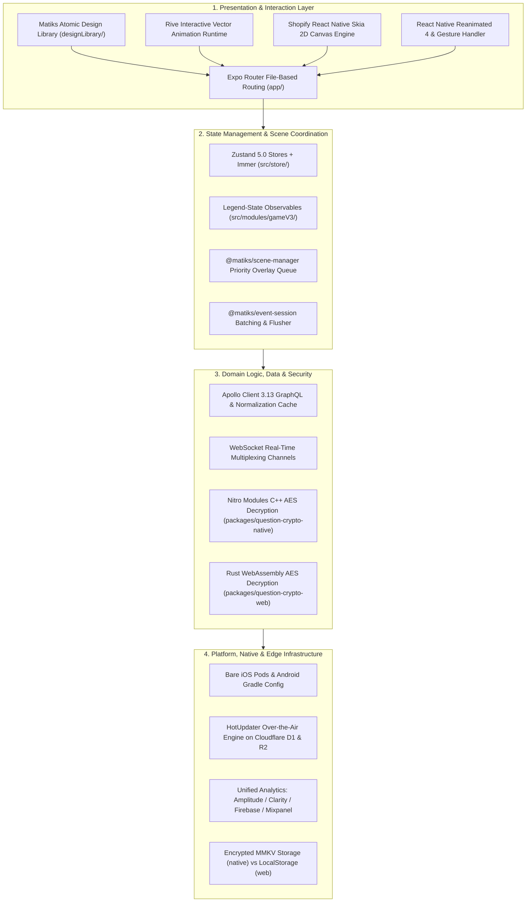
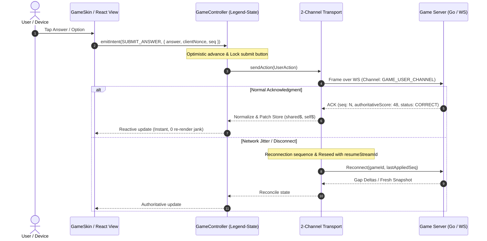
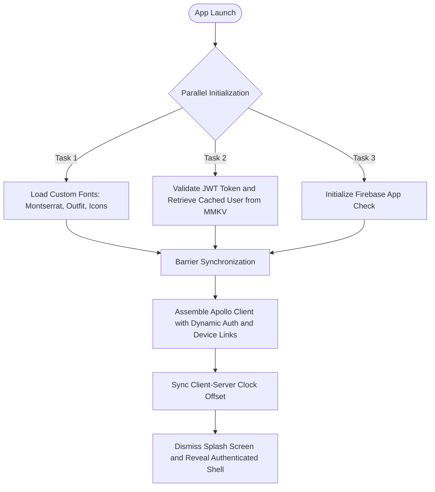
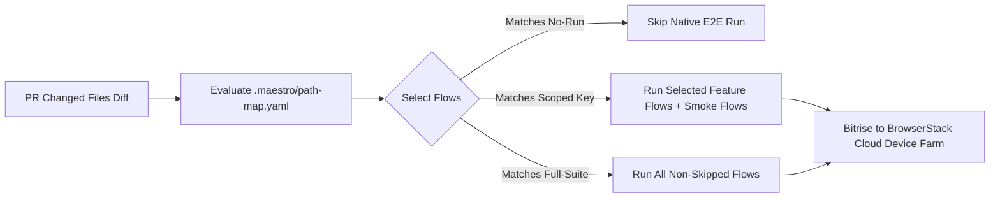

# Comprehensive Technical Deep-Dive Report: Matiks Client (`matiks-client`)

---

## 1. Executive Summary & Product Ecosystem

**Matiks Client** (`matiks-client`) is a universal, cross-platform mobile (iOS & Android) and web super-application built with **React Native (v0.86)**, **React 19**, **Expo (v57 Bare Workflow)**, **Expo Router**, and **TypeScript**.

Matiks is an **interactive competitive mathematics, logic puzzle, and educational gaming super-app**. It gamifies cognitive training and arithmetic into fast-paced multiplayer esports, live asynchronous and synchronous duels, structured school/college tournaments, and social community engagement.

```
                                 ┌──────────────────────────────────────────────────────────┐
                                 │                   MATIKS SUPER-APP                       │
                                 └────────────────────────────┬─────────────────────────────┘
                                                              │
         ┌────────────────────────────┬───────────────────────┴───────────────┬────────────────────────────┐
         │                            │                                       │                            │
┌────────▼────────┐          ┌────────▼────────┐                     ┌────────▼────────┐          ┌────────▼────────┐
│  LIVE GAMEPLAY  │          │ PUZZLES & SNAC  │                     │ TOURNAMENTS &   │          │ SOCIAL & VIRTUAL│
│     ENGINE      │          │     ENGINE      │                     │     LEAGUES     │          │     ECONOMY     │
├─────────────────┤          ├─────────────────┤                     ├─────────────────┤          ├─────────────────┤
│ • DMAS Blitz    │          │ • Infinite Feed │                     │ • Showdown Swiss│          │ • 1:1/Group Chat│
│ • Flash Anzan   │          │ • Level Map     │                     │ • Survival Sat. │          │ • Clubs/Forums  │
│ • Time Bank     │          │ • Sudoku/Queens │                     │ • Brumble Cup   │          │ • User Feed V2  │
│ • Ability Duels │          │ • Zip / Tango   │                     │ • League V2     │          │ • Buddy Streaks │
│ • CrossMath     │          │ • Pipes/Patches │                     │ • Weekly League │          │ • Pi-Coin Store │
│ • KenKen/Maze   │          │ • Daily Puzzles │                     │ • Inter-Club    │          │ • Certificates  │
└─────────────────┘          └─────────────────┘                     └─────────────────┘          └─────────────────┘
```

### 1.1. Core Product Pillars
1. **Competitive Real-Time Duels**: Matchmaking engine allowing players across the globe to compete head-to-head in speed arithmetic (DMAS: Division, Multiplication, Addition, Subtraction), soroban-style Flash Anzan, and strategic Time-Bank puzzles.
2. **"SNAC" Infinite Puzzle Feed & Level Map**: A TikTok-style vertical puzzle reel combined with an interactive fantasy world map supporting diverse logic puzzle mechanics (`Sudoku`, `Queens`, `Zip`, `Patches`, `Tango`, `Pipes`).
3. **Structured Esports & Competitions**:
   - **Showdown**: Multi-round tournament brackets and Swiss-system matches.
   - **Survival Saturday**: Timed sudden-death elimination competitions.
   - **Brumble**: Inter-college competitive championship with team rosters, captains, qualifiers, and playoffs.
   - **League V2 & Weekly League**: Tiered competitive division rankings featuring promotion/demotion cutoffs.
4. **Social Fabric & Community**: Real-time messaging with wagerable in-chat challenges, dynamic activity feeds, peer accountability "Buddy Streaks", and institution/club hubs.
5. **Gamified Virtual Economy**: Virtual currencies (PIES coins and Statik coins), streak shields, consumable XP boosters, custom avatars, collectable achievement badges, and cryptographically verifiable digital certificates.

---

## 2. High-Level Architecture & Tech Stack

Matiks follows a layered, decoupled universal application architecture ensuring zero logic duplication between mobile platforms (iOS/Android) and Web while maintaining platform-native performance.



### 2.1. Technology Specification Matrix

| Component | Library / Framework | Version | Engineering Rationale |
| :--- | :--- | :--- | :--- |
| **Core Framework** | React Native / React | 0.86.0 / 19.2.3 | Modern React architecture with Concurrent Features and Hermes engine. |
| **App Framework** | Expo (Bare Workflow) | ~57.0.0 | Direct native control without prebuild destruction; native folders committed. |
| **Routing** | Expo Router | ~57.0.8 | Type-safe, file-based routing with deep-link resolution and nested layouts. |
| **Server State** | Apollo Client | ^3.13.8 | GraphQL caching, pagination, upload link support, and schema mirroring. |
| **Global Client State** | Zustand | ^5.0.3 | Lightweight, unopinionated state management paired with Immer and `useShallow`. |
| **Reactive Game State** | Legend-State | 2.1.15 | Zero-overhead reactive observables for high-frequency live duel rendering. |
| **Real-Time Network** | WebSockets / `graphql-ws` | ^6.0.5 | Low-latency duplex event transport for live duels, chat, and presence. |
| **Native Cryptography** | Nitro Modules / C++ | 0.35.10 | Hardware-accelerated native decryption of anti-cheat question payloads. |
| **Web Cryptography** | Rust / WebAssembly | Custom | High-speed in-browser Wasm decryption without exposing keys in JS. |
| **Vector Animation** | Rive | 0.4.19 | Mascot interactions, interactive reward reveals, and state-machine animations. |
| **2D Graphics & Canvas** | React Native Skia | 2.9.1 | Dynamic CPU/GPU rasterization, level-map path rendering, and charts. |
| **Fluid UI Motion** | Reanimated / Gesture Handler | 4.5.0 / ~2.32.0 | 120fps UI animations, bottom sheet dragging, and physics-based interactions. |
| **Over-the-Air Updates** | Hot Updater | 0.35.5 | Instant multi-channel bundle deployments via Cloudflare Workers and D1. |
| **Native Build CI** | Bitrise & S3 Cache | Custom | Fingerprint-driven native binary caching to skip redundant compilation. |
| **End-to-End Testing** | Maestro | Custom | Declarative YAML-based mobile testing suite with PR diff-scoped execution. |

---

## 3. Directory Layout & Repository Anatomy

```
/Users/pramiths/Documents/Matiks/matiks-client/
├── .cursor/ & .claude/           # AI Assistant Rules (Code Styles, Animations, a11y)
├── .maestro/                     # Maestro E2E Test Suite (Flows, Subflows, Path Map)
├── android/ & ios/               # Committed Bare Native Android and iOS Projects
├── app/                          # Expo Router File-Based Routing Tree
│   ├── (app)/                    # Authenticated Routes (Tabs, Game, Modals)
│   ├── _layout.tsx               # Root Layout with Provider Waterfall & Error Boundaries
│   └── index.tsx                 # App Entrypoint & Session Bootstrap Gate
├── designLibrary/                # Atomic Design System (Tokens, Storybook, Components)
├── docs/                         # Architecture Specs (GameV3, ADRs, Permissions, OTA)
├── packages/                     # Specialized Internal Packages & Native Modules
│   ├── event-session/            # Post-activity event buffering and animation coordinator
│   ├── message-queue/            # Offline-first reliable messaging pipeline
│   ├── observability/            # Tracing, telemetry, and structured logging
│   ├── perf-lab/                 # On-device hardware performance & jank benchmarking
│   ├── question-crypto-native/   # C++ Nitro Module for anti-cheat native question decryption
│   ├── question-crypto-web/      # Rust/Wasm module for anti-cheat web question decryption
│   └── scene-manager/            # Framework-agnostic priority overlay & modal queue
├── scripts/                      # Build, Codegen, Release, Quality, and CI Scripts
├── src/
│   ├── components/               # Shared Atom, Molecule, and Organism UI Components
│   ├── constants/ & theme/       # Color Palettes, Typography, and Game Constants
│   ├── core/                     # Core Platform Engines (Analytics, Cache, GQL, OTA, Audio)
│   ├── modules/                  # 74 Domain-Driven Feature Modules
│   ├── overlays/                 # Root Global Overlays (Toasts, Challenges, Rematches)
│   └── store/                    # 40+ Domain-Scoped Zustand Global Stores
├── hot-updater.config.ts         # HotUpdater OTA Configuration (Cloudflare D1 & R2)
├── app.config.ts                 # Runtime Expo Bundle & Scheme Configuration
└── package.json                  # Dependencies, Aliases, Quality Checks & Scripts
```

---

## 4. Deep-Dive: Dual Gameplay Engines (`gameV2` vs `gameV3`)

Real-time gameplay is the centerpiece of the Matiks platform. The repository contains both the active production engine (`gameV2`) and the next-generation server-authoritative engine (`gameV3`).



### 4.1. Comparison Matrix: GameV2 vs GameV3

| Dimension | `gameV2` (Legacy Active Engine) | `gameV3` (Next-Gen FSM Engine) |
| :--- | :--- | :--- |
| **State Ownership** | Global module-level Zustand store (`useGameStoreV2`). | Per-session runtime instance (`session.ts`) using **Legend-State**. |
| **Viewer Context** | Hardcoded to authenticated user (`currentUserId`). | Parameterized `viewerId`, enabling Spectating and Multi-Game Views. |
| **Phase Derivation** | Implicitly derived from incoming server payloads. | Explicit, pure Finite State Machine (FSM) driven by monotonic events. |
| **Idempotency** | Vulnerable to double-submits on network retry. | Built-in `clientNonce` with monotonic `seq` fencing per question. |
| **Render Performance** | Frequent React tree re-renders driven by timer ticks. | Fine-grained Legend observables (`shared$`, `self$`) with zero timer jank. |
| **Reconnection Model** | Ad-hoc listener re-attachment without sequence recovery. | Structured 2-channel transport with `resumeStreamId` & replay buffer. |
| **Score Reader** | Mixed scoring heuristics across components. | Unified all-or-nothing scoreboard truth engine (`scoreReader.ts`). |

### 4.2. GameV3 Architecture & Implementation
* **Domain Layer (`src/modules/gameV3/domain/`)**: Completely pure TypeScript. Contains no React and no I/O. Defines action validators, snapshot projection rules (`projectSnapshot.ts`), and viewer-relative readers (`scoreReader.ts`).
* **Transport Layer (`src/modules/gameV3/transport/`)**: Encapsulates WebSocket and GraphQL communications behind interfaces. Handles connection state transitions, message deduplication, and replay queues.
* **Controller Layer (`src/modules/gameV3/controller/`)**:
  - `session.ts`: Instantiates isolated Legend-State observables (`control$`, `shared$`, `self$`, `descriptor$`).
  - `submit.ts`: Handles answer submission with locking, optimistic progression, client nonce generation, and timeout fallbacks.
  - `reconnection.ts`: Executes edge-grammar socket reconnection and state reconciliation.
  - `overtime.ts`: Manages tie-breaking deadline overtime periods.

---

## 5. Comprehensive Catalog of Supported Game Modes

Defined in [`src/core/constants/gameTypes.ts`](file:///Users/pramiths/Documents/Matiks/matiks-client/src/core/constants/gameTypes.ts), Matiks games are divided into distinct cognitive categories:

```
                                  ┌────────────────────────────────────────────────────────┐
                                  │                  MATIKS GAME SUITE                     │
                                  └───────────────────────────┬────────────────────────────┘
                                                              │
               ┌──────────────────────────────┬───────────────┴──────────────┬──────────────────────────────┐
               │                              │                              │                              │
     ┌─────────▼─────────┐          ┌─────────▼─────────┐          ┌─────────▼─────────┐          ┌─────────▼─────────┐
     │   MATH / BLITZ    │          │   LOGIC PUZZLE    │          │  MENTAL AGILITY   │          │  MEMORY / VISUAL  │
     ├───────────────────┤          ├───────────────────┤          ├───────────────────┤          ├───────────────────┤
     │ • DMAS            │          │ • Sudoku          │          │ • Flash Anzan     │          │ • Pinball Recall  │
     │ • Time Bank Duels │          │ • CrossMath       │          │ • Fastest Finger  │          │ • Mind Snap       │
     │ • Ability Duels   │          │ • KenKen          │          │ • Fastest Tap     │          │ • Queens / Zip    │
     │ • SpeedRun        │          │ • Math Maze       │          │ • Group Play      │          │ • Tango / Pipes   │
     └───────────────────┘          └───────────────────┘          └───────────────────┘          └───────────────────┘
```

1. **DMAS (Division, Multiplication, Addition, Subtraction)**: High-speed arithmetic duels testing raw calculation agility.
2. **Flash Anzan**: Soroban abacus mental visualization. Numbers flash on the screen at rapid intervals (sub-second) for mental addition.
3. **Time Bank Duels**: Players start with a shared bank of time. Answering faster carries over spare seconds as a strategic advantage into later questions.
4. **Sudoku & Mini-Sudoku Duels**: Speed number placement grids adhering to traditional Latin-square rules under real-time duel constraints.
5. **CrossMath**: Mathematical crossword puzzles where numbers and operators are placed to balance horizontal and vertical equations.
6. **KenKen & Math Maze**: Arithmetic grid puzzles combining region cages with mathematical target operations.
7. **Pinball Recall & Mind Snap**: Spatial memory retention, sequence reproduction, and rapid visual pattern recognition.

---

## 6. Monorepo Modular Packages (`packages/`)

Located in [`packages/`](file:///Users/pramiths/Documents/Matiks/matiks-client/packages), these standalone packages decouple complex subsystem logic from UI rendering:

```
packages/
├── question-crypto-native/   # C++ / Nitro Module implementing hardware-accelerated AES decryption
├── question-crypto-web/      # Rust WebAssembly package compiling decryption to Wasm
├── scene-manager/            # Decoupled priority queue for sequencing dialogs, modals & banners
├── event-session/            # Buffers and choreographs rapid post-game achievement popups
├── message-queue/            # Offline-first persistent message delivery pipeline
├── observability/            # Structured logging, distributed tracing & metrics
└── perf-lab/                 # Automated Android performance testing harness (measure jank & frames)
```

### 6.1. `@matiks/question-crypto-native` & `@matiks/question-crypto-web` (Anti-Cheat)
* **Threat Model**: Prevent players from opening browser DevTools or proxying network packets to read question answers before the timer starts.
* **Architecture**: The server ships question bundles encrypted with dynamic session keys.
* **Native Implementation**: Written in **C++** using **Nitro Modules** ([`QuestionCrypto.nitro.ts`](file:///Users/pramiths/Documents/Matiks/matiks-client/packages/question-crypto-native/src/specs/QuestionCrypto.nitro.ts)). Compiled directly into native binaries for hardware-accelerated AES decryption.
* **Web Implementation**: Written in **Rust** and compiled to **WebAssembly (Wasm)**. Executes in an isolated Wasm memory sandbox on Web.

### 6.2. `@matiks/scene-manager`
* **Problem**: In a rich gamified app, multiple modals (Level Up, Daily Quest Completed, Streak Milestone, Friend Invite) can arrive simultaneously, leading to overlapping popups, z-index glitches, and broken animation transitions.
* **Solution**: A priority-based `SceneQueue<TMeta>` that sorts scenes by priority integer, guarantees only one active scene animates on screen, handles gesture dismissals, and auto-advances through the queue.

### 6.3. `@matiks/event-session`
* **Function**: Buffers high-frequency post-game events arriving over WebSockets and GraphQL within a configurable time window (`bufferWindowMs`). Deduplicates redundant events, executes attached async side effects (such as analytics flushes), and drains them cleanly into UI handlers.

### 6.4. `@matiks/perf-lab`
* **Function**: Automated device profiling harness for rooted Android devices. Runs preset automated user journeys (cold boots, sprint duels, navigation sweeps), sampling frame jank, CPU load, memory footprints, and thread allocations against committed performance baselines.

---

## 7. Core Platform Infrastructure (`src/core/`)

[`src/core/`](file:///Users/pramiths/Documents/Matiks/matiks-client/src/core) houses foundational platform capabilities consumed across all modules:

```
src/core/
├── analytics/         # Multi-provider analytics dispatcher (Amplitude, Clarity, Firebase, Mixpanel)
├── audio/             # Sound manager leveraging expo-audio for game sound effects
├── cache/             # Multiplatform persistent key-value store (MMKV on native, LocalStorage on web)
├── graphql/           # GraphQL SDL schema mirrors, codegen types, and Apollo link configurations
├── ota/               # Over-the-air update manager wrapping HotUpdater with channel resolution
├── permissions/       # Normalized permission lifecycle handling (Camera, Contacts, Notifications, Media)
└── providers/         # Bootstrap, Auth, Navigation, and Server-Time synchronizer providers
```

### 7.1. Parallelized Startup Bootstrap (`AppBootstrapProvider.tsx`)
Replaces sequential waterfall initialization with an optimized parallel startup lifecycle:



### 7.2. Deferred Analytics Dispatcher (`DeferredAnalyticsInitializer.ts`)
* **Problem**: Loading 6 heavy analytics SDKs (Amplitude, Microsoft Clarity, Firebase Analytics, Mixpanel, AppsFlyer, WebEngage) on app launch blocks the JS thread and hurts Time-To-Interactive (TTI).
* **Optimization**: Sentry and Crashlytics initialize eagerly on startup. All other analytics SDKs register initialization tasks that execute via `requestIdleCallback` (with a `setTimeout` fallback), waiting until the main JS thread is idle after the first paint.

### 7.3. Cross-Platform Unified Permissions Engine
Defined in [`src/core/permissions/`](file:///Users/pramiths/Documents/Matiks/matiks-client/src/core/permissions):
* Centralizes camera, contacts, notifications, and media library access.
* Normalizes platform differences between iOS Permission APIs, Android Runtime Permissions, and Web Browser Permissions into a unified `PermissionResult` interface (`isUsable`, `canAskAgain`, `status`).
* Prevents redundant OS prompt calls by checking cached state and deduplicating concurrent in-flight requests.

### 7.4. Fast Encrypted Storage (`CacheStorage`)
* **Native (iOS/Android)**: Implements `react-native-mmkv` with AES encryption keys (`matiks-secure-storage-key-2024`), providing direct synchronous C++ memory-mapped file storage.
* **Web**: Implements structured `LocalStorage` with synchronous fallbacks and JSON parsing guards.

---

## 8. Complete Breakdown of Feature Modules (`src/modules/`)

The repository organizes business logic into 74 domain-driven feature modules in [`src/modules/`](file:///Users/pramiths/Documents/Matiks/matiks-client/src/modules). Below is the comprehensive classification:

### 8.1. Gameplay & Competitions
* **`gameV2`**: Active real-time duel engine for 1v1 and group matchmaking, gameplay, and results.
* **`gameV3`**: Next-generation server-authoritative FSM duel engine built with Legend-State.
* **`infinitePuzzle`**: SNAC endless logic puzzle feed, level-map ladder, and Skia CPU sprite-baking engine.
* **`dailyChallenges` & `dailies`**: Calendar-driven daily math, puzzle, and memory challenges with global and institution leaderboards.
* **`compete` & `contest`**: Unified contest hub, creator leagues, office leagues, and League V2 tab view.
* **`showdown` & `showdownV2`**: Multi-round Swiss tournament fixtures, live round hubs, and tournament brackets.
* **`survivalSaturday`**: Timed sudden-death survival math tournaments with real-time elimination.
* **`brumble`**: Inter-college team e-sports championship management (team creation, roster selection, qualifiers, playoffs).
* **`interClubTeamTournament` & `teamMatch` & `teamMatchTournament`**: Club vs. Club competitive team matchups.
* **`matiksWeeklyLeague` & `league` & `leagueRewards`**: Tiered weekly XP ranking leagues with promotion/demotion boundaries and reward claim forms.
* **`speedRun`**: Solo time-attack game mode against the clock.
* **`practice`**: Offline and unranked solo gameplay practice mode.
* **`watch`**: Spectator mode for viewing ongoing friend matches and top-tier duels.

### 8.2. Social & Community
* **`chatV2` & `liveChat`**: Real-time 1:1 and group chat over WebSockets with Tenor GIF search, media attachments, and in-chat wagered duels.
* **`clubs` & `clubCategoryEvent`**: Community clubs featuring announcement boards, discussion forums, member role management, and internal events.
* **`userFeedV2` & `feedChallengeStrips`**: Social feed displaying friend accomplishments, match victories, and badge unlocks with likes and comments.
* **`friends` & `friendsAndFollowers` & `PlayFriends` & `searchMathletes`**: Friend request management, user search, presence tracking, and direct friend challenges.

### 8.3. Gamification, Progression & Identity
* **`streak` & `buddyStreak` & `streakCommitment`**: Daily streak calendars, freeze shields, streak milestone rewards, and paired Buddy Streaks.
* **`quests` & `starterQuest`**: Daily quests, monthly milestone progress bars, and progressive new-user starter quests.
* **`achievements` & `rewardsAndRecognition`**: Unlockable accomplishment badges and tiered trophy showcase.
* **`certificates`**: Verifiable digital achievement certificates with public web URLs and image export.
* **`monthly-report`**: Instagram-story-style monthly progress recap with animated Rive cards and shareable summary stats.
* **`insights`**: Comprehensive player skill analytics dashboard plotting accuracy, phase times, and game-shape graphs.
* **`profile` & `completeProfile`**: User profile management (avatars, banners, showcased badges, bio, social links, and account export).
* **`matiksPiStore` & `store` & `subscription`**: Virtual rewards store to spend PIES coins on streak shields, XP boosters, and avatars.
* **`flex`**: Post-game victory card generator for sharing achievements on social media platforms.

### 8.4. User Onboarding, Lifecycle & System
* **`auth` & `unauth`**: Authenticated session provider, phone OTP login/signup, Google/Apple OAuth, and guest accounts.
* **`onboarding` & `activation` & `mascotActivation`**: Interactive new-user onboarding workflows with Rive mascot guidance.
* **`moderation` & `reportUser` & `reportPost`**: User reporting, content moderation gates, and user blocking.
* **`userSettings`**: App settings (sound effects, haptic toggles, language preferences, notification settings).
* **`userScene`**: Event-driven scene manager orchestrating celebratory modals and popups.
* **`developer`**: In-app developer utility menu, network request logger, and cache inspection tools.

---

## 9. State Management Architecture (`src/store/`)

Matiks utilizes **Zustand 5.0** (paired with Immer for immutable updates and `useShallow` for referential stability) as its primary client state management solution across 40+ stores in [`src/store/`](file:///Users/pramiths/Documents/Matiks/matiks-client/src/store):

```
src/store/
├── useAuthStore/                 # Authentication state, active JWT session, user credentials
├── useUserStore/                 # Current logged-in user profile, PIES balance, preferences
├── useGameStoreV2/               # GameV2 live game state, questions, players, and timer slices
├── useChatStore/                 # Chat conversation threads, message history, drafts, failed queue
├── useFeedStoreV2/               # Social feed posts, celebrated feeds, comments, and unread counters
├── useStreakStore/               # Daily streak counts, streak calendar, shields balance, commitments
├── useBuddyStreakStore/          # Paired buddy streak state, buddy presence, invitation status
├── useInfinitePuzzleStore/       # SNAC puzzle reel buffer, level-map progression, saved drafts
├── useQuestsStore/               # Active daily quests, monthly quest progress, claimable rewards
├── useDailyChallengeStore/       # Calendar daily challenges, submissions, local resume cache
├── useUnifiedContestsStore/      # Registered tournament contests, friends participation cache
├── useShowdownStore/             # Showdown tournament phases, brackets, fixtures, and standings
├── useSurvivalSaturdayStore/     # Survival Saturday tournament state, lives remaining, attempts
├── useBrumbleStore/              # College esports team rosters, qualifiers, and playoff fixtures
├── useWebSocketStore/            # Global WebSocket connection status, multiplexed subscriptions
├── useXPBoosterStore/            # Active XP booster multipliers and remaining duration timers
├── useInAppNotificationStore/    # In-app toast and push notification queue
└── useUserSceneStore/            # Global scene overlay presentation queue
```

* **Anti-Pattern Guard**: To prevent unnecessary React re-renders, stores are consumed via primitive selectors (e.g., `useStore(s => s.score)`) or wrapped with `useShallow` to ensure referential equality.

---

## 10. Design System & Accessibility Standards (`designLibrary/`)

All UI components adhere strictly to the Matiks Design System located in [`designLibrary/`](file:///Users/pramiths/Documents/Matiks/matiks-client/designLibrary):

```
designLibrary/
├── Avatar/             # User avatar supporting vector tokens, image fallbacks & presence dots
├── Badge/ & Pill/      # Colored status badges, rank indicators & category chips
├── Button/             # 3D interactive button supporting sound, haptics, loading & a11y
├── BottomSheet/        # Gesture-driven modal bottom sheet powered by @gorhom/bottom-sheet
├── CheckBox/ & Radio/  # Form selection controls
├── Dropdown/           # Accessible dropdown selection menu
├── Header/             # Standardized navigation header with back-action guards and title
├── LeaderboardRow/     # Competitive ranked row displaying avatar, rank, username, and score
├── SelectionPopover/   # Contextual popover menu
├── TabView/ & TabBar/  # Swipeable animated tab navigator built on Reanimated
└── Toast/              # Non-blocking status notification toast
```

### 10.1. Accessibility (a11y) Quality Gate
* Every interactive control must provide explicit React Native accessibility props (`accessibilityRole`, `accessibilityLabel`, `accessibilityState`).
* Automated Pull Request audits run `yarn a11y-changed` to guarantee that all newly created `<Pressable>` or `<Button>` elements pass accessibility inspection.

---

## 11. Testing, Quality Assurance & Build Infrastructure

### 11.1. Static Code Analysis & Guardrails
* **Strict TypeScript**: Configured with strict compiler flags (`tsconfig.json`).
* **ESLint "No-New-Any" Ratchet**: Uses [`eslint-suppressions.json`](file:///Users/pramiths/Documents/Matiks/matiks-client/eslint-suppressions.json) to grandfather legacy `any` types while failing CI if any new `any` is introduced in changed files.
* **Require Cycle Gate**: [`scripts/check-require-cycles.js`](file:///Users/pramiths/Documents/Matiks/matiks-client/scripts/check-require-cycles.js) checks Metro require cycles against a committed baseline (`scripts/require-cycles.baseline.json`), failing if new circular dependencies are introduced.
* **React Doctor**: Analyzes component render efficiency, unmemoized object allocations, and hook dependency issues.

### 11.2. Maestro End-to-End Testing Suite
Located in [`.maestro/`](file:///Users/pramiths/Documents/Matiks/matiks-client/.maestro), the project uses **Maestro** for mobile automated testing on real devices via BrowserStack and Bitrise:



* **Smoke Flows**: Core flows (Login, Home navigation) tagged `smoke` that execute on every active run.
* **Path-Scoped Selection**: Dynamically matches changed files against path map globs to run only the affected test flows, drastically reducing CI build times.

### 11.3. Native Build Cache & OTA Deployment
* **Native Build Cache ([`scripts/native-cache/`](file:///Users/pramiths/Documents/Matiks/matiks-client/scripts/native-cache))**: Computes an `@expo/fingerprint` hash of the native folders (`ios/`, `android/`), native dependencies, and Gradle/Podfile configs. On Bitrise CI, if the fingerprint matches an S3 cache entry, the precompiled native binary is downloaded and repacked with the new JS bundle in under 2 minutes, avoiding a 20-minute full Xcode/Gradle build.
* **Over-The-Air (OTA) Updates**: Uses **Hot Updater** on Cloudflare Workers and D1 database to publish immediate JavaScript-only updates across `development`, `preview`, and `production` channels (`yarn ota:deploy:production`).

---

## 12. Summary Architecture Cheat-Sheet

| System Dimension | Implementation Detail / File Path |
| :--- | :--- |
| **Root Layout & Bootstrap** | [`app/_layout.tsx`](file:///Users/pramiths/Documents/Matiks/matiks-client/app/_layout.tsx) $\rightarrow$ [`AppBootstrapProvider.tsx`](file:///Users/pramiths/Documents/Matiks/matiks-client/src/core/providers/AppBootstrapProvider.tsx) |
| **Main Authenticated Tabs** | [`app/(app)/(tabs)/_layout.tsx`](file:///Users/pramiths/Documents/Matiks/matiks-client/app/(app)/(tabs)/_layout.tsx) (`home`, `snac`, `contests`, `dailies`, `quests`, `feed`) |
| **GraphQL Schema Source** | Committed SDL mirror in [`src/core/graphql/schema/`](file:///Users/pramiths/Documents/Matiks/matiks-client/src/core/graphql/schema/) $\rightarrow$ Generated via `yarn codegen` |
| **Active Live Duel Engine** | [`src/modules/gameV2/`](file:///Users/pramiths/Documents/Matiks/matiks-client/src/modules/gameV2) $\rightarrow$ Zustand store & WebSocket handlers |
| **Next-Gen Duel Engine** | [`src/modules/gameV3/`](file:///Users/pramiths/Documents/Matiks/matiks-client/src/modules/gameV3) $\rightarrow$ Pure Domain FSM + Legend-State observables |
| **Anti-Cheat Decryption** | [`packages/question-crypto-native/`](file:///Users/pramiths/Documents/Matiks/matiks-client/packages/question-crypto-native) (C++) & [`packages/question-crypto-web/`](file:///Users/pramiths/Documents/Matiks/matiks-client/packages/question-crypto-web) (Rust/Wasm) |
| **Overlay Queue Manager** | [`packages/scene-manager/`](file:///Users/pramiths/Documents/Matiks/matiks-client/packages/scene-manager) (Priority queue decoupling dialogs from UI) |
| **UI Design System** | [`designLibrary/`](file:///Users/pramiths/Documents/Matiks/matiks-client/designLibrary) (20+ accessible atomic components + Storybook) |
| **E2E Automation Engine** | Maestro flows in [`.maestro/flows/`](file:///Users/pramiths/Documents/Matiks/matiks-client/.maestro/flows) with PR diff path-map filtering |
| **OTA Delivery Engine** | [`hot-updater.config.ts`](file:///Users/pramiths/Documents/Matiks/matiks-client/hot-updater.config.ts) (Cloudflare D1 Database & R2 Storage) |
